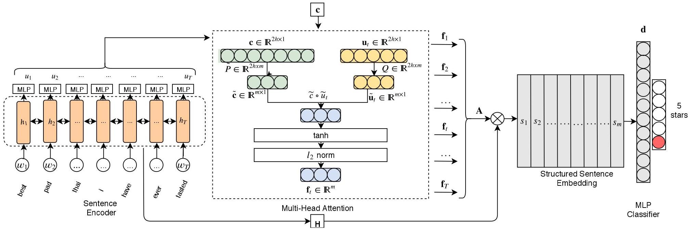

[](https://travis-ci.org/JohnGiorgi/compact-multi-head-self-attention-pytorch)
[](https://www.codacy.com/manual/JohnGiorgi/compact-multi-head-self-attention-pytorch?utm_source=github.com&amp;utm_medium=referral&amp;utm_content=JohnGiorgi/compact-multi-head-self-attention-pytorch&amp;utm_campaign=Badge_Grade)
[](https://www.codacy.com/manual/JohnGiorgi/compact-multi-head-self-attention-pytorch?utm_source=github.com&utm_medium=referral&utm_content=JohnGiorgi/compact-multi-head-self-attention-pytorch&utm_campaign=Badge_Coverage)

# PyTorch Implementation of Low Rank Factorization for Compact Multi-Head Self-Attention (LAMA)

This is a PyTorch implementation of the __L__ ow Rank F __a__ ctorization for Compact __M__ ulti-Head __A__ ttention (LAMA) mechanism and the corresponding pooler introduced in the paper: "[Low Rank Factorization for Compact Multi-Head Self-Attention](https://arxiv.org/abs/1912.00835)".



> Figure 1 from [Low Rank Factorization for Compact Multi-Head Self-Attention](https://arxiv.org/abs/1912.00835).

Note: I am _not_ one of the authors on the paper.

## Usage

The only dependency is PyTorch. Installation instructions can be found [here](https://pytorch.org/get-started/locally/).

### LAMA

```python
import torch
from modules.lama import LAMA

num_heads = 8      # Number of attention heads
input_dim = 768    # Dimension of each tokens hidden representation
batch_size = 16    # Number of sentences/documents in the mini-batch
max_seq_len = 100  # Maximum length of the input sequence

# Create a random input sequence
inputs = torch.randn(batch_size, max_seq_len, input_dim)  

# Initialize the attention mechanism
lama = LAMA(num_heads, input_dim)

output = lama(inputs)
assert output.size() == (batch_size, num_heads, max_seq_len)
```

### LAMAPooler

```python
import torch
from modules.lama_pooler import LAMAPooler

num_heads = 8      # Number of attention heads
input_dim = 768    # Dimension of each tokens hidden representation
batch_size = 16    # Number of sentences/documents in the mini-batch
max_seq_len = 100  # Maximum length of the input sequence

# Create a random input sequence
inputs = torch.randn(batch_size, max_seq_len, input_dim)  

# Initialize the pooler
lama_pooler = LAMAPooler(num_heads, input_dim)

pooled_output = lama_pooler(inputs)
assert pooled_output.size() == (batch_size, num_heads * input_dim)
```